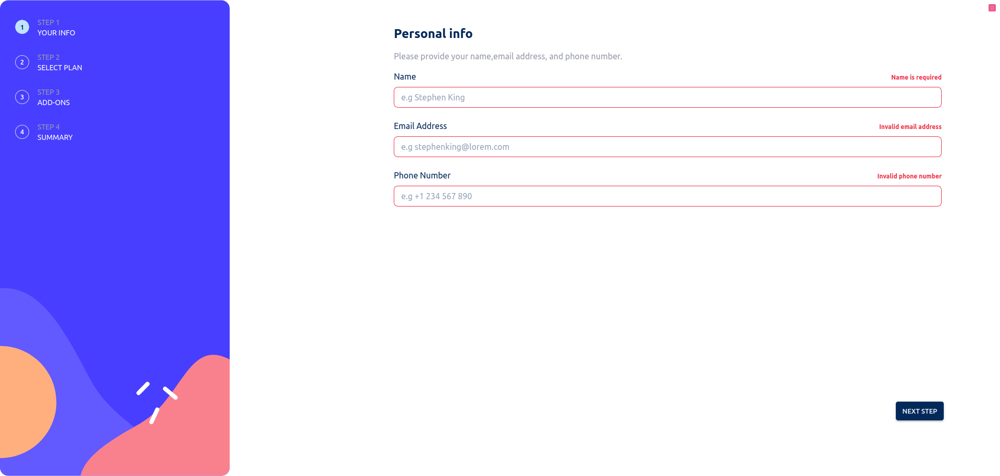
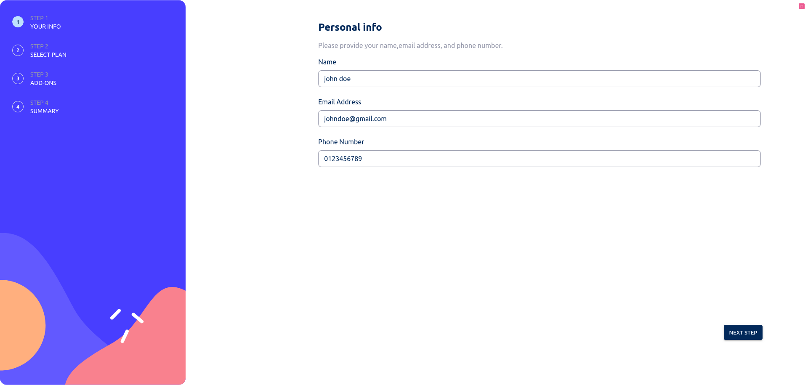
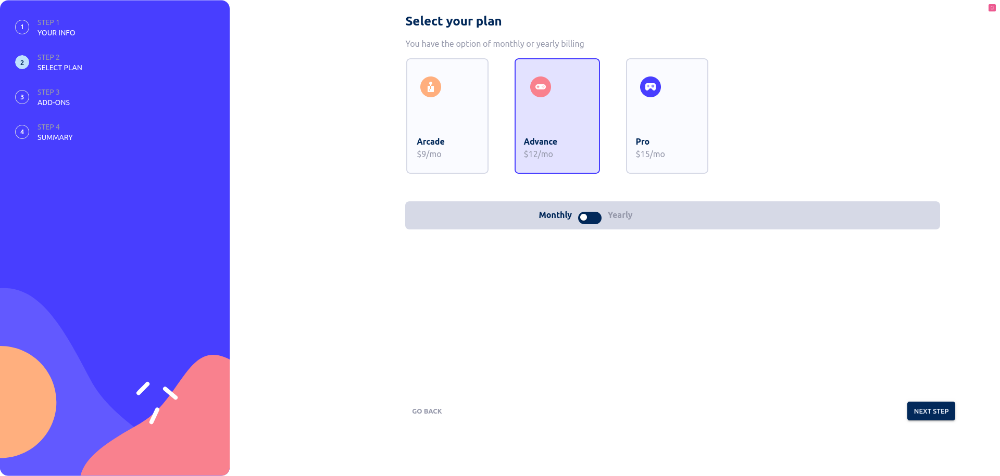
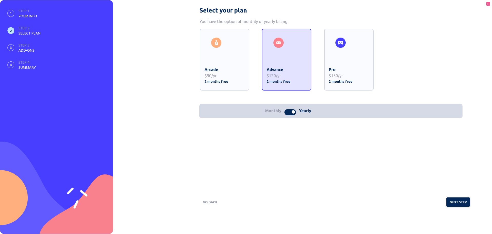
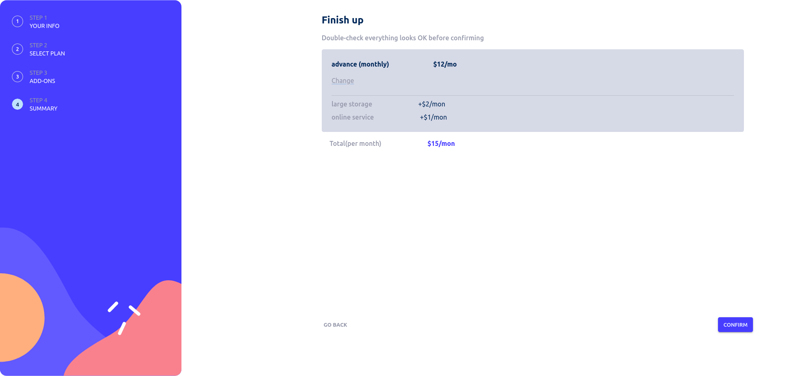
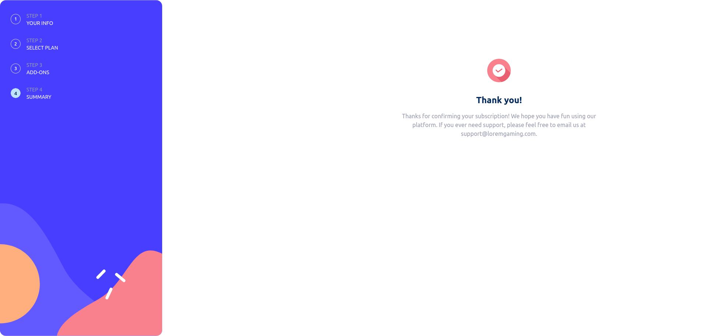

# Frontend Mentor - Multi-step form solution

This is a solution to the [Multi-step form challenge on Frontend Mentor](https://www.frontendmentor.io/challenges/multistep-form-YVAnSdqQBJ). Frontend Mentor challenges help you improve your coding skills by building realistic projects. 

## Table of contents

- [Overview](#overview)
  - [The challenge](#the-challenge)
  - [Screenshot](#screenshot)
  - [Links](#links)
- [My process](#my-process)
  - [Built with](#built-with)
  - [What I learned](#what-i-learned)
- [Author](#author)

## Overview

### The challenge

Users should be able to:

- Complete each step of the sequence
- Go back to a previous step to update their selections
- See a summary of their selections on the final step and confirm their order
- View the optimal layout for the interface depending on their device's screen size
- See hover and focus states for all interactive elements on the page
- Receive form validation messages if:
  - A field has been missed
  - The email address is not formatted correctly
  - A step is submitted, but no selection has been made

### Screenshot

### Links

- Solution URL: [Add solution URL here](https://github.com/Samwelomwenga/multi-step-form)
- Live Site URL: [Add live site URL here](https://multi-step-form-cq3goivt2-samwelomwenga.vercel.app/)

## My process

### Built with

- CSS custom properties
- Flexbox
- CSS Grid
- Mobile-first workflow
- [React](https://reactjs.org/) - JS library
- [Material UI](https://mui.com/) - For styles
- [Redux ToolKit](https://redux-toolkit.js.org/) - For global state management
- [React Hooks Form](https://react-hook-form.com/) - For form state management
- [Zod ](https://zod.dev/) - For form state validation

### What I learned

Learned on how to manage an application global state using Redux Toolkit
Learned on how to style  an application using Material UI
Learned on how to manage form  state using React Hooks Form
Learned on how to do form validation using Zod.

## Author

- Website - [SAMWEL OMWENGA](https://github.com/Samwelomwenga)
- Frontend Mentor - [@Samwelomwenga](https://www.frontendmentor.io/profile/Samwelomwenga)

